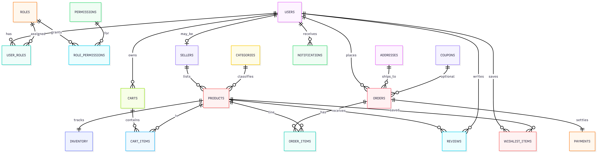

<div align="center">


# 🛒 MarketGrid

<p align="center">


</p>

### 📌 Demonstrates Core DBMS Concepts and Monitoring

**Normalization · ACID Transactions · Concurrency Control · Triggers · Views · RBAC**

<p align="center">
  <a href="https://ecommerce.ananthadev.online">
    
  </a>
</p>

### 🌐 Live App
**https://ecommerce.ananthadev.online**

</div>

---

# ✨ Overview

MarketGrid is a production-style e-commerce application built to demonstrate practical DBMS concepts in a realistic system workflow.

The project focuses heavily on:

- Relational schema design
- Normalization
- ACID transactions
- Concurrency control
- SQL triggers & views
- RBAC authorization
- Polyglot persistence
- Event-driven architecture

Unlike traditional academic mini-projects, this application demonstrates how DBMS concepts appear inside real software systems.

---

# 🏗️ Architecture

<p align="center">
  
</p>

## Architecture Summary

- **React + Vite** provides the frontend UI
- **FastAPI** exposes REST APIs
- **PostgreSQL** handles transactional relational data
- **MongoDB** stores flexible logs & telemetry
- **RabbitMQ** handles asynchronous processing
- **Docker Compose** orchestrates all services

### Why this architecture?

| Component | Why Used |
|---|---|
| PostgreSQL | ACID transactions, joins, constraints, triggers |
| MongoDB | Flexible event logging & telemetry |
| RabbitMQ | Async email & event processing |
| FastAPI | Fast REST APIs with dependency injection |
| React | Realistic frontend workflow |

---

# 🧩 ER Diagram

<p align="center">
  
</p>

## Main Entities

- Users
- Roles
- Permissions
- Products
- Categories
- Inventory
- Orders
- Payments
- Reviews
- Cart Items
- Wishlist Items
- Notifications

### Relationships Demonstrated

- One-to-many
- Many-to-many
- Transactional relationships
- RBAC bridge tables

---

# ⚡ Quick Start

## Run Entire Application

```bash
docker compose up --build
```

---

# 🌐 Services

| Service | URL |
|---|---|
| Frontend | http://localhost:5173 |
| Backend API | http://localhost:8001 |
| Swagger Docs | http://localhost:8001/docs |
| PostgreSQL | localhost:5432 |
| MongoDB | localhost:27017 |
| RabbitMQ | localhost:5672 |
| RabbitMQ Dashboard | http://localhost:15672 |

---

# 🔑 Seeded Demo Accounts

| Role | Email | Password |
|---|---|---|
| Admin | admin@example.com | Admin123! |
| Seller | seller@example.com | Seller123! |
| Buyer | buyer@example.com | Buyer123! |

### Coupon
```txt
SAVE10
```

---

# 🧠 DBMS Concepts Demonstrated

## PostgreSQL Features

- Normalized relational schema
- Primary & foreign keys
- CHECK & UNIQUE constraints
- Transactions & rollback
- `SELECT ... FOR UPDATE`
- SQL joins & aggregates
- Views
- SQL functions
- Triggers
- Audit logging

---

## ACID Transaction Demonstration

Checkout flow performs:

1. Cart validation
2. Inventory locking
3. Order creation
4. Order item insertion
5. Payment insertion
6. Cart cleanup
7. Commit / rollback

If any step fails, the entire transaction rolls back.

---

## Concurrency Control

The application uses:

```sql
SELECT ... FOR UPDATE
```

to prevent:

- Overselling inventory
- Race conditions
- Concurrent stock corruption

---

## PostgreSQL Triggers

Implemented trigger workflows:

- Inventory auto decrement
- Low stock notifications
- Order confirmation after payment
- SQL audit logging before delete

---

# 📈 Monitoring & Observability

MarketGrid includes a production-style monitoring and observability stack using:

- Prometheus
- Grafana
- Node Exporter
- PostgreSQL Exporter
- RabbitMQ Exporter
- Application Metrics Exporter

This setup enables real-time infrastructure, database, queue, and application monitoring.

## Monitoring Architecture

| Component | Purpose |
|---|---|
| Prometheus | Metrics collection & storage |
| Grafana | Visualization dashboards |
| Node Exporter | VM and system metrics |
| PostgreSQL Exporter | Database monitoring |
| RabbitMQ Exporter | Queue monitoring |
| App Metrics Exporter | FastAPI application metrics |

---

## Metrics Monitored

### Infrastructure Metrics
Collected using **Node Exporter**:
- CPU utilization
- Memory usage
- Disk usage
- Network traffic
- System load

### PostgreSQL Metrics
Collected using **PostgreSQL Exporter**:
- Active connections
- Transaction throughput
- Query statistics
- Cache hit ratio
- Database uptime

### RabbitMQ Metrics
Collected using **RabbitMQ Exporter**:
- Queue depth
- Message throughput
- Consumer activity
- Queue acknowledgements

### Application Metrics
Collected from the FastAPI metrics endpoint:
- HTTP request count
- API request latency
- Endpoint usage
- Response status codes
- Application uptime

---

## Why Monitoring Was Added

The monitoring stack demonstrates how production systems maintain:

- observability
- reliability
- performance analysis
- infrastructure monitoring
- backend health tracking
- database monitoring
- queue monitoring
- application performance monitoring

This extends the project beyond a traditional CRUD application into a production-oriented distributed backend system.

---

## MongoDB Usage (Yet to be implemented)

MongoDB stores:

- Product view logs
- Recommendation logs
- User activity logs
- Notification logs
- Support chat logs
- Flexible audit events

This demonstrates **polyglot persistence**.

---

# 🔐 RBAC (Role-Based Access Control)

Roles implemented:

- Admin
- Seller
- Customer

Database tables:

- users
- roles
- permissions
- user_roles
- role_permissions

FastAPI dependencies enforce authorization at API level.

---

# 📦 Project Structure

```bash
ecommerce-dbms/
│
├── backend/        # FastAPI backend
├── frontend/       # React frontend
├── docs/           # Documentation & diagrams
├── docker-compose.yml
└── README.md
```

---

# 🔌 API Surface

## Authentication

- `POST /api/auth/register`
- `POST /api/auth/login`
- `GET /api/auth/me`

## Products

- `GET /api/products`
- `GET /api/products/{id}`
- `POST /api/products/seller`

## Cart & Checkout

- `GET /api/cart`
- `POST /api/cart`
- `POST /api/orders/checkout`

## Wishlist & Reviews

- `GET /api/wishlist`
- `POST /api/reviews/product/{id}`

## Admin APIs

- `/api/admin/analytics/*`
- `/api/admin/audit/sql`
- `/api/admin/products/*`

## Seller APIs

- `/api/seller/orders`
- `/api/seller/analytics/sales`

---

# 📊 SQL Views

The application includes analytical views:

- `v_top_selling_products`
- `v_monthly_sales`
- `v_active_customers`

These simplify complex reporting queries.

---

# 🧮 SQL Function

Custom reusable SQL function:

```sql
fn_order_item_subtotal(order_id, product_id)
```

Used for reusable subtotal calculations.

---

# 📨 RabbitMQ Event Flow

RabbitMQ is used for:

- Email job queues
- Async notifications
- Event processing

The worker service consumes queued events asynchronously.

---

# 🐳 Dockerized Deployment

All services are containerized using Docker Compose.

Benefits:

- Easy setup
- Consistent environments
- Simplified deployment
- Service isolation

---

# 📚 Documentation

Additional documentation available inside:

```bash
docs/
```

Includes:

- Normalization notes
- Trigger explanations
- Transaction walkthroughs
- MongoDB justification
- ER modeling notes

---

# 🎯 Demo Highlights

During project demonstration:

- Login as buyer
- Browse products
- Add items to cart
- Checkout transaction
- Seller inventory management
- Admin analytics dashboard
- SQL audit log demonstration
- MongoDB event logging

---

# 🏁 Conclusion

MarketGrid demonstrates how core DBMS concepts integrate into real-world software systems instead of isolated academic examples.

The project combines:

- Relational database design
- Transaction management
- Concurrency control
- Trigger automation
- RBAC security
- Polyglot persistence
- Event-driven architecture

making it ideal for:

- DBMS demonstrations
- Viva presentations
- Resume projects
- Portfolio showcases

---

# 📄 License

Educational / Demonstration Use

---

# ⭐ Acknowledgements

Inspired by production-grade e-commerce architectures and modern database system design principles.
