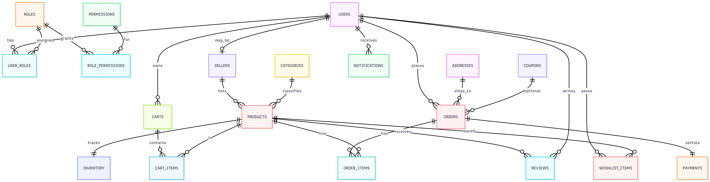

<div align="center">


# 🛒 MarketGrid

<p align="center">


</p>


**DBMS:** Normalization · ACID Transactions · Concurrency Control · Triggers · Views · RBAC

**Infrastructure:** Kubernetes · Docker Compose · Minikube · NGINX Ingress · HPA

**Observability:** Prometheus · Grafana · Node Exporter

> 🚧 The current Kubernetes deployment runs locally on Minikube. AWS deployment is planned.

</div>

---

## Overview

MarketGrid is an e-commerce platform built to demonstrate the integration of database engineering and cloud-native infrastructure. The platform showcases how relational DBMS constraints, polyglot persistence, asynchronous messaging, and container orchestration interoperate in a microservice ecosystem.

The system handles transactional checkouts with PostgreSQL ACID guarantees, streams system telemetry into MongoDB, offloads order events to RabbitMQ, and dynamically scales backend pods via Horizontal Pod Autoscalers (HPA) behind an NGINX Ingress controller.

## Table of Contents

- [Project Snapshot](#project-snapshot)

- [Features](#features)

- [Tech Stack](#tech-stack)

- [Architecture](#architecture)

- [System Design](#system-design)

- [DBMS Concepts](#dbms-concepts)

- [Kubernetes & Infrastructure](#kubernetes--infrastructure)

- [Infrastructure Diagram](#infrastructure-diagram)

- [Monitoring & Observability](#monitoring--observability)

- [Project Structure](#project-structure)

- [API Documentation](#api-documentation)

- [Quick Start](#quick-start)

- [Docker Compose Deployment](#docker-compose-deployment)

- [Kubernetes Deployment Guide](#kubernetes-deployment-guide)

- [Monitoring Setup](#monitoring-setup)

- [CI/CD](#cicd)

- [Deployment Evolution](#deployment-evolution)

- [Future Improvements](#future-improvements)

  
## Project Snapshot

| **Area** | **Status** | **Notes** |
|---|---|---|
| **E-Commerce Application** | Implemented | Transactional buyer, seller, and admin workflows |
| **PostgreSQL Relational Core** | Implemented | ACID transactions, row-level locking, views, and triggers |
| **MongoDB Integration** | Implemented | NoSQL document store for application activity/log data |
| **RabbitMQ Event Broker** | Implemented | Event publisher for checkout notification events |
| **Docker Compose** | Implemented | Original multi-container local deployment |
| **Kubernetes / Minikube** | Implemented | Declarative local cluster deployment and orchestration |
| **NGINX Ingress** | Implemented | Unified L7 path-based routing (`/` and `/api`) |
| **Rolling Updates** | Implemented | Controlled backend version rollout with Kubernetes Deployments |
| **Horizontal Pod Autoscaler (HPA)** | Implemented | CPU-based backend scaling from 2 to 5 Pods |
| **Prometheus & Grafana** | Implemented | Kubernetes/node metrics collection and visualization |
| **k6 Load Testing** | Planned | Load testing and observation of HPA/system behavior |
| **Helm Charts** | Planned | Reusable Kubernetes package/deployment management |
| **AWS / EKS Deployment** | Planned | Cloud deployment after completing the local Kubernetes workflow |
| **Asynchronous Worker Service** | Planned | RabbitMQ consumer for background notification processing |


## Features

### Application

- **Buyer Workflows:** Product catalog, cart management, checkout execution, order history, wishlist, and product reviews.

- **Seller Workflows:** Inventory allocation, product publishing, stock management, and fulfillment tracking.

- **Admin Operations:** User management, catalog moderation, audit tracking, and platform analytics.

### Backend

- **FastAPI Microservices:** High-performance REST APIs powered by Pydantic DTOs and SQLAlchemy ORM.

- **Auth & Security:** OAuth2 JWT authentication and Role-Based Access Control (RBAC).

- **Asynchronous Integration:** Event publishing to RabbitMQ and activity logging to MongoDB.

### Database Engineering

- **PostgreSQL:** ACID-compliant checkout transactions, pessimistic row-level locking (`SELECT ... FOR UPDATE`), triggers, views, and SQL functions.

- **MongoDB:** Document store for unstructured application logs and activity records.

### Infrastructure & Monitoring

- **Kubernetes:** Declarative deployments, services, ConfigMaps, Secrets, and NGINX Ingress routing.

- **Scaling & Resilience:** Metrics Server integration, HPA auto-scaling (2 to 5 replicas), and rolling updates.

- **Observability:** Cluster-level metric scraping via Prometheus, Node Exporter telemetry, and Grafana visualization.

## Tech Stack

| **Layer**              | **Technology**                     | **Purpose**                                      |
| ---------------------- | ---------------------------------- | ------------------------------------------------ |
| **Frontend**           | React 18, Vite, Tailwind CSS       | Single Page Application (SPA) UI                 |
| **Backend**            | Python 3.12, FastAPI, SQLAlchemy   | REST API framework & ORM layer                   |
| **Database Migration** | Alembic                            | Version-controlled schema migrations             |
| **Relational DB**      | PostgreSQL 15                      | Transactional core data store                    |
| **NoSQL DB**           | MongoDB 6                          | Unstructured log & document store                |
| **Message Broker**     | RabbitMQ 3                         | Distributed message broker                       |
| **Containerization**   | Docker, Docker Compose             | Container packaging & local orchestration        |
| **Orchestration**      | Kubernetes, Minikube               | Cluster deployment, networking, and scaling      |
| **Networking**         | NGINX Ingress Controller           | Ingress routing (`/` and `/api`)                 |
| **Scaling**            | Metrics Server, HPA                | Resource-based horizontal pod autoscaling        |
| **Observability**      | Prometheus, Grafana, Node Exporter | Cluster metrics scraping & visualization         |
| **CI/CD**              | GitHub Actions                     | Automated linting, testing, and container builds |

## Architecture

Traffic enters the cluster through an NGINX Ingress Controller, which routes `/` to the Frontend Service and `/api` to the Backend Service. The backend communicates with PostgreSQL for relational operations, MongoDB for logging, and RabbitMQ for event distribution.

<p align="center">
  
</p>


### Component Roles

- **NGINX Ingress:** Handles incoming L7 traffic and path routing.

- **Frontend Pods:** Serves compiled static React + Vite web assets.

- **Backend Pods:** Executes FastAPI endpoints, JWT auth, and database transactions.

- **PostgreSQL:** Persists users, products, orders, and payments under ACID transactions.

- **MongoDB:** Stores non-relational system and access logs.

- **RabbitMQ:** Receives order-completed events.

## System Design

- **Frontend:** Built with React 18 and Vite. Interacts asynchronously with backend APIs via HTTP JSON calls.

- **Backend:** Built with FastAPI. Uses SQLAlchemy for PostgreSQL sessions, Motor/PyMongo for MongoDB logs, and pika for RabbitMQ event publishing.

- **Polyglot Storage:** Relational data requiring strong consistency resides in PostgreSQL. Dynamic, unstructured logs reside in MongoDB.

- **Kubernetes Control:** Deployments handle stateless applications, Services provide internal cluster IPs, ConfigMaps/Secrets supply runtime environment variables, and HPA maintains backend target utilization.

## DBMS Concepts

- **Normalization:** The relational database is normalized to 3rd Normal Form (3NF) to guarantee schema integrity and eliminate redundancy.

- **ACID Transactions:** Cart checkouts execute inside an atomic transaction block: cart verification -> stock locking -> stock deduction -> order insertion -> payment record -> cart purge -> commit/rollback.

- **Concurrency Control:** Employs row-level locking via `SELECT ... FOR UPDATE` during checkouts to prevent race conditions and stock overselling.

- **Relational Constraints:** Enforces Primary Keys, Foreign Keys (`ON DELETE CASCADE` / `RESTRICT`), UNIQUE constraints on emails, and CHECK constraints on stock and prices.

- **Triggers & Views:** Uses PL/pgSQL triggers to update modification timestamps automatically, and relational views (e.g., `v_top_selling_products`) for pre-aggregated analytics.

- **RBAC Enforcement:** Maps users to system roles (`BUYER`, `SELLER`, `ADMIN`), enforced across API dependencies.

### ER Diagram

<p align="center">
  
</p>


## Kubernetes & Infrastructure

- **Cluster Environment:** Configured for local Minikube execution across two isolated namespaces: `ecommerce` (Core Application) and `monitoring` (Observability).

- **Services & Networking:** Internal communication occurs via ClusterIP Services. External access is unified under NGINX Ingress.

- **Rolling Updates:** Deployments specify a `RollingUpdate` strategy (`maxSurge: 1`, `maxUnavailable: 0`) for continuous availability during image updates.

- **HPA Configuration:**

  - Target: Backend Deployment CPU utilization at 60%.

  - Range: Minimum 2 replicas, maximum 5 replicas.

  - Scale-Up: 100% expansion per 60 seconds.

  - Scale-Down: 50% reduction per 60 seconds with a 60-second stabilization window.

## Infrastructure Diagram

```
─────────────────────────────────────────────────────────────────────────────────
                                MINIKUBE CLUSTER
─────────────────────────────────────────────────────────────────────────────────

 [ End Users ] ──► Ingress ──► Services ──► Deployments ──► Pods
                                                                │
                                    ┌───────────────────────────┼───────────────────────────┐
                                    ▼                           ▼                           ▼
                              PostgreSQL 15                 MongoDB 6                   RabbitMQ 3
                           (ecommerce namespace)       (ecommerce namespace)       (ecommerce namespace)

 [ Metrics Server ] ──► [ Backend HPA ] ──► [ Backend Deployment ]

 [ Node Exporter ] ──► [ Prometheus ] ──► [ Grafana ]
 (monitoring namespace)  (monitoring namespace)  (monitoring namespace)

```

## Monitoring & Observability

Observability is decoupled from autoscaling:

- **Metrics Server:** Fetches temporary resource metrics (CPU/Memory) used exclusively by the HPA controller for scaling actions.

- **Prometheus:** Scrapes and stores time-series metric data from cluster nodes and services.

- **Grafana:** Connects to Prometheus to render visualization dashboards.

- **Node Exporter:** Runs in the `monitoring` namespace to collect system-level hardware metrics.

## Project Structure

```
ecommerce/
├── .github/
│   └── workflows/          # CI/CD pipeline definitions (ci.yml, cd.yml)
├── backend/
│   ├── alembic/            # Database schema migration scripts
│   ├── app/                # FastAPI source code (api, models, routes, schemas)
│   ├── scripts/            # Database seeding utilities
│   ├── Dockerfile          # Backend container image specification
│   └── requirements.txt    # Python dependencies
├── frontend/
│   ├── src/                # React source code
│   ├── Dockerfile          # Frontend container image specification
│   └── package.json        # Node.js dependencies
├── k8s/                    # Kubernetes Declarative Manifests
│   ├── namespace.yaml      # ecommerce namespace definition
│   ├── configmap.yaml      # Non-sensitive configuration
│   ├── secrets.yaml        # Base64 encoded secrets
│   ├── *-deployment.yaml   # Workload manifests (postgres, mongo, rabbitmq, etc.)
│   ├── ingress.yaml        # NGINX Ingress routing rules
│   └── monitoring/         # Observability manifests (prometheus, grafana, etc.)
├── docs/                   # Documentation resources & visual diagrams
├── docker-compose.yml      # Multi-container orchestration specification
└── README.md               # Main repository guide

```

## API Documentation

FastAPI generates interactive documentation available when running the application:

- **Swagger UI:** `/api/docs`

- **ReDoc:** `/api/redoc`

### Key Endpoints

| **Group**    | **Method** | **Endpoint**           | **Description**            | **Authentication** |
| ------------ | ---------- | ---------------------- | -------------------------- | ------------------ |
| **Auth**     | `POST`     | `/api/auth/register`   | Register new user account  | None               |
| **Auth**     | `POST`     | `/api/auth/login`      | Authenticate and issue JWT | None               |
| **Products** | `GET`      | `/api/products`        | List and filter catalog    | None               |
| **Products** | `POST`     | `/api/products`        | Create product listing     | Seller / Admin     |
| **Cart**     | `GET`      | `/api/cart`            | Get shopping cart          | Buyer              |
| **Cart**     | `POST`     | `/api/cart`            | Add product to cart        | Buyer              |
| **Orders**   | `POST`     | `/api/orders/checkout` | Execute ACID cart checkout | Buyer              |
| **Orders**   | `GET`      | `/api/orders`          | View user order history    | Buyer              |
| **Reviews**  | `POST`     | `/api/reviews`         | Submit product review      | Buyer              |
| **Wishlist** | `GET`      | `/api/wishlist`        | Get user wishlist          | Buyer              |
| **Seller**   | `GET`      | `/api/seller/products` | View seller inventory      | Seller             |
| **Admin**    | `GET`      | `/api/admin/users`     | List platform users        | Admin              |

## Quick Start

Run the complete multi-service application locally:

1. Clone the repository.

2. Run the multi-container stack using Docker Compose: `docker compose up --build`

3. Access the Frontend at `http://localhost:3000`.

4. Access the API Documentation at `http://localhost:8000/docs`.

## Docker Compose Deployment

Docker Compose served as the original deployment method for containerization and local development:

- **Container Isolation:** Standardizes dependencies across environments.

- **Service Networking:** Establishes automatic DNS resolution between container services.

- **Local Iteration:** Facilitates rapid testing of multi-tier interactions prior to Kubernetes deployment.

## Kubernetes Deployment Guide

Deploy into Minikube using the declarative manifests in `k8s/`:

1. Start Minikube with required addons: `ingress` and `metrics-server`.

2. Point your terminal to Minikube's Docker daemon and build the application images.

3. Apply the manifests in sequence: `namespace.yaml`, `configmap.yaml`, `secrets.yaml`, infrastructure deployments (`postgres`, `mongo`, `rabbitmq`), microservices (`backend`, `frontend`), and `ingress.yaml`.

4. Verify resource creation using standard `kubectl get` commands (`pods`, `svc`, `ingress`, `hpa`).

5. Map `marketgrid.local` to the Minikube IP address in your hosts file to access the system.

## Monitoring Setup

Deploy observability tools into the `monitoring` namespace:

1. Apply manifests in `k8s/monitoring/` (`node-exporter.yaml`, `prometheus.yaml`, `grafana.yaml`).

2. Verify running pods in the `monitoring` namespace.

3. Access Grafana at `http://localhost:3001` or Prometheus at `http://localhost:9090` by forwarding service ports locally.

## CI/CD

Automated workflows are configured in `.github/workflows/`:

- **`ci.yml`:** Executes Flake8 linting and Pytest unit tests on the backend, runs ESLint and production builds on the frontend, and verifies Docker image builds on every push.

- **Deployment Execution:** Kubernetes cluster deployment is currently performed manually from the local development environment.

## Deployment Evolution

```
Phase 1: Application & DBMS Design
E-Commerce Monolith + PostgreSQL + MongoDB + RabbitMQ
  │
  ▼
Phase 2: Docker Compose
Containerized Multi-Service Deployment
  │
  ▼
Phase 3: Kubernetes Orchestration
Minikube Cluster (Pods, Deployments, Services, ConfigMaps, Secrets)
  │
  ▼
Phase 4: Networking & Dynamic Scaling
NGINX Ingress Controller + Rolling Updates + Metrics Server + HPA
  │
  ▼
Phase 5: Cluster Observability
Prometheus + Grafana + Node Exporter
  │
  ▼
Next: Planned Improvements
Background Worker Service + Helm Charts + AWS EKS Migration

```

## Future Improvements

The following improvements are planned for future releases:

- Complete asynchronous Worker Service for RabbitMQ event processing.

- Convert raw Kubernetes manifests into a modular Helm chart.

- AWS EKS deployment with managed RDS PostgreSQL and DocumentDB.

- Implement k6 load testing scripts to evaluate HPA scaling dynamics under heavy traffic.

- Add PostgreSQL Exporter and RabbitMQ Exporter to Prometheus.

- Introduce Kubernetes `NetworkPolicies` for fine-grained pod communication security.

- **Metrics Separation:** The Kubernetes Metrics Server serves short-term resource metrics for HPA, whereas Prometheus collects long-term metrics for historical observability.
