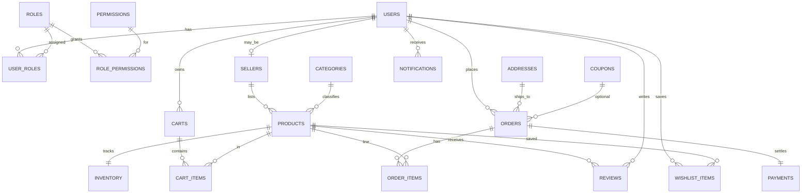

# Database design & concepts

## 1. ER diagram (conceptual)

## 2. Relational schema (physical)

Tables are created via SQLAlchemy models and the initial Alembic revision:

`users`, `roles`, `permissions`, `role_permissions`, `user_roles`, `sellers`, `categories`, `products`, `inventory`, `carts`, `cart_items`, `addresses`, `orders`, `order_items`, `payments`, `reviews`, `notifications`, `coupons`, `wishlist_items`, `sql_audit_log`.

Key constraints:

- **PK/FK** with referential integrity (e.g. `order_items.order_id → orders.id`).
- **UNIQUE**: `users.email`, `products.slug`, `payments.order_id` (one payment per order), `reviews (product_id, user_id)`, `wishlist_items (user_id, product_id)`.
- **CHECK**: non-negative prices, inventory quantity, rating 1–5, cart/order line quantities positive.
- **Indexes**: illustrative indexes on orders `(status, created_at)`, inventory `quantity`, order_items `product_id`.

Views and SQL function are defined in the same Alembic migration alongside triggers.

## 3. Normalization (1NF / 2NF / 3NF)

- **1NF**: atomic columns (no repeating groups in relational tables).
- **2NF**: composite keys avoided except where modeled as association tables (`user_roles`, `role_permissions`, `cart_items` surrogate `id` with unique `(cart_id, product_id)` where appropriate).
- **3NF**:

  - Addresses are isolated from orders (shipping snapshot could be extended; current model stores `address_id`).
  - `inventory` separated from `products` (non-key dependency on stock levels).
  - `payments` separated from `orders` (lifecycle of payment differs from order).
  - Roles/permissions normalized into junction tables rather than bitmask columns.

## 4. Transaction workflow — checkout (`OrderCheckoutService`)

1. Resolve shipping address for the authenticated user.
2. Optional coupon validation (`min_order_amount`, percent/amount discounts).
3. **`BEGIN`** (via SQLAlchemy `session.begin()` context).
4. For each distinct `product_id` in **sorted order** (deadlock avoidance), lock `inventory` with **`SELECT … FOR UPDATE`** and validate quantities against storefront rules (active + approved products).
5. Insert `orders` (`pending`).
6. Insert `order_items` → **trigger** reduces stock.
7. Insert `payments` with `completed` → **trigger** confirms order.
8. Clear `cart_items`.
9. **`COMMIT`** — if any Python exception fires, **`ROLLBACK`** undoes inserts and trigger side effects (*ACID*: trigger effects participate in same transaction).

**Demo rollback**: POST `/orders/checkout` with `simulate_failure: true` intentionally aborts **before commit** — no order, no inventory change.

### Concurrency & serializability

Two sessions checking “last unit” concurrently: without locking, both could pass validation. **`FOR UPDATE`** serializes competing transactions on the same inventory rows at the application level, matching **serializable** intent for those hot rows. Document as *pessimistic row-level locking* + single transaction boundary.

## 5. Triggers (PostgreSQL)

Defined in `alembic/versions/20250510120000_initial_schema_triggers_views.py`:

| Trigger | Event | Effect |
|--------|--------|--------|
| `trg_after_order_item_insert` | `AFTER INSERT` on `order_items` | Decrement `inventory.quantity` for the line’s product. |
| `trg_inventory_low_stock` | `AFTER UPDATE OF quantity` on `inventory` | If `quantity < reorder_threshold`, insert a **seller** `notifications` row. |
| `trg_payment_insert_completed` / `trg_payment_update_completed` | `AFTER INSERT/UPDATE` on `payments` | When `status = completed`, set parent `orders.status` to `confirmed`. |
| `trg_before_product_delete_audit` | `BEFORE DELETE` on `products` | Insert into `sql_audit_log` with JSON snapshot of deleted row. |

## 6. Advanced SQL in the app

- **JOIN / GROUP BY / HAVING / aggregates**: seller sales endpoint; admin dashboard revenue subquery; analytics views (`v_*`).
- **Nested subqueries**: admin revenue aggregates completed payments inside an `IN` filter.
- **Views**: analytical rollups surfaced to the React admin UI.

## 7. MongoDB — why here?

Mongo collections (`product_view_logs`, `recommendation_logs`, `user_activity_logs`, `notification_logs`, `chat_support_messages`, `audit_logs`) capture **high-volume, semi-structured, append-mostly** telemetry:

| Concern | Relational hurt | Mongo fit |
|---------|-----------------|----------|
| Variable JSON payloads | rigid migrations per event type | flexible documents |
| Write-heavy telemetry | transactional overhead | cheap inserts |
| Exploratory analytics | star schema churn | pipeline-friendly |

**SQL remains source of truth** for money, inventory, identities, RBAC assignments. Mongo complements observability—not financial ledger replacement.

*(Triggers write to relational `sql_audit_log`—Mongo `audit_logs` is for richer app-layer JSON without blocking OLTP DDL.)*

## 8. Role-based authorization (application + conceptual GRANT)

- **JWT** carries identity; **`user_roles`** table maps users to **`roles`**.
- FastAPI **`require_roles`** guard enforces `/admin/*` vs `/seller/*` vs shopper routes.

**Conceptual `GRANT` mapping** (essay-style, not executed by the app):

- `GRANT SELECT, INSERT … ON carts, cart_items TO app_customer_role;`
- `GRANT SELECT, INSERT … ON products TO app_read_catalog;`
- `GRANT ALL ON PRODUCTS (seller-owned rows via RLS/policy) …` *(advanced; here enforced in Python by `seller_user_id == current_user.id`).*
- `GRANT EXECUTE ON FUNCTION fn_order_item_subtotal TO app_reporting_role;`

## 9. Indexes & performance notes

Demonstrative indexes accompany hot paths: order listing, inventory scans, product joins in order lines. For a production system, add partial indexes (e.g. `WHERE is_active`) and full-text search (or external engine) for catalog search.

---

This document is meant for **DBMS coursework narrative**: pair it with live demos (`docker compose up`, checkout with/without rollback, admin SQL audit after product delete, Mongo Compass inspection of log collections).
